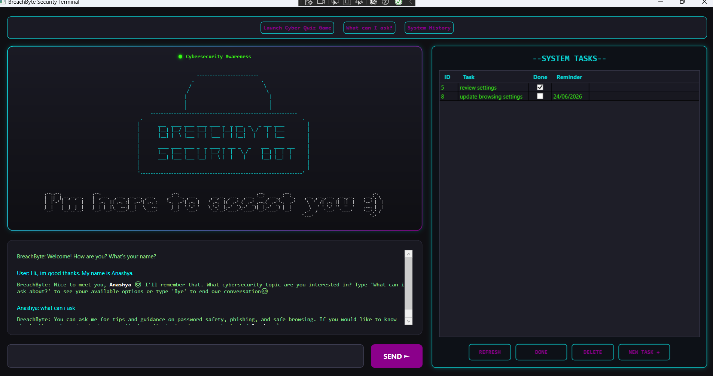
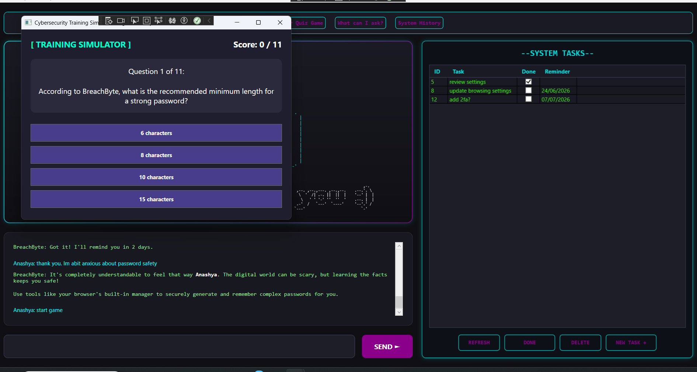
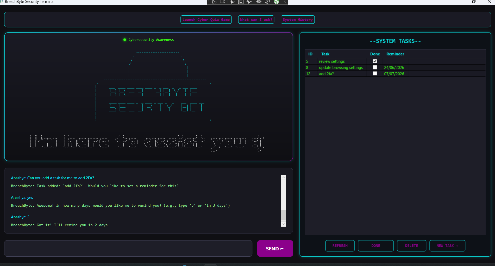
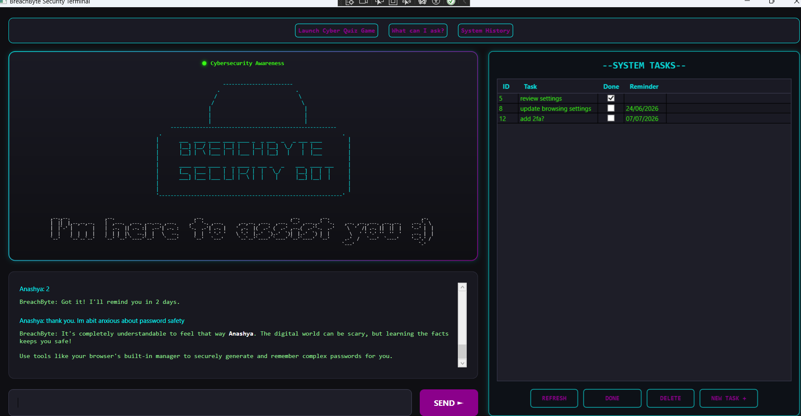
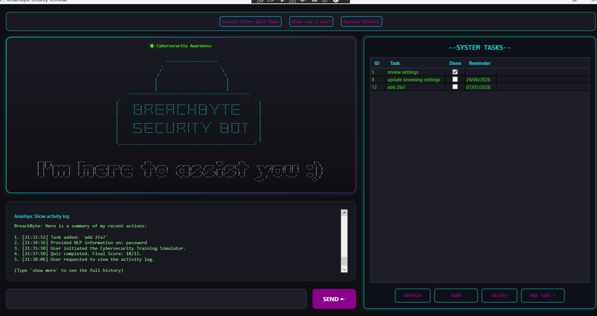

# BreachByte Security Bot: Cybersecurity Awareness Bot

BreachByte is a cybersecurity education chatbot with a neon-terminal look and feel, built in C# and WPF. It combines natural language task management, an interactive security quiz, and a MySQL-backed activity log to make learning about phishing, malware, and online safety more engaging than a typical awareness course.

📺 **Demo Videos**
- [Final Demo - Part 1](https://youtu.be/hFbHpYT0pFw)
- [Final Demo - Part 2](https://youtu.be/ehVnbIf2pQM)

## Features

- **Advanced WPF GUI** — a custom-styled dashboard featuring linear gradients, drop-shadow glows, ControlTemplates, and a responsive dual-column layout
- **Gamification & Async Audio** — an object-oriented quiz engine with dynamic UI switching and asynchronous audio feedback that prevents visual thread freezing
- **MySQL Database Integration** — full CRUD capability syncing the GUI DataGrid with a backend SQL database for persistent task storage
- **Regex-Powered NLP** — a natural language processing engine using regular expressions to dynamically extract intents, paired with short-term state memory to handle multi-turn conversational prompts (e.g. yes/no reminder confirmations)
- **Asynchronous Typing Effect** — simulates a real-time conversation by rendering text letter-by-letter without locking the application window
- **Contextual Memory & Sentiment** — extracts the user's name and detects emotional tone to provide empathetic, tailored responses

## Tech Stack

- **Language:** C#
- **Framework:** WPF (.NET)
- **Database:** MySQL
- **Version Control:** Git, GitHub

## Screenshots

**Main Terminal**

**Cybersecurity Quiz**

**Task Management via Natural Language**

**Empathetic Sentiment Response**

**Activity Log**

## Setup

**Software Requirements**
- Visual Studio 2022 with the **.NET Desktop Development** workload enabled
- MySQL Server and MySQL Workbench

**Database Setup**
1. Execute the provided SQL script to generate the `cyber_tasks` table
2. Update the connection string in `DatabaseHelper.cs` with your own local MySQL credentials

**Open Project**
1. Clone or download this repository
2. Double-click the `.sln` file to launch the project in Visual Studio

**Audio Assets**
Ensure the following files are present in your project folder: `VoiceGreeting.wav`, `CorrectSound.wav`, `IncorrectSound.wav`, `Applause.wav`. Right-click each in Visual Studio → Properties → set **Copy to Output Directory** to "Copy if newer".

**Run**
Press F5 or click Start to launch the terminal.

## Usage

Interact with BreachByte using the Quick Access Navigation Bar, or by typing conversational commands into the terminal.

**Standard Commands**
- `[ LAUNCH CYBER QUIZ ]` or type **"start game"** — launches the interactive cybersecurity quiz
- `[ VIEW TOPICS ]` or type **"what can i ask"** — displays available learning modules
- `[ SYSTEM HISTORY ]` or type **"show activity log"** — pulls up a session activity summary

**Task Management (NLP Engine)**
- Add a task with natural language, e.g. *"Add a new task to update my firewall"* — the NLP engine extracts the task, saves it to MySQL, and refreshes the UI instantly
- Manage tasks via the System Tasks grid — mark complete or delete

**Educational Topics**
- Phishing — identifying malicious emails
- Password Safety — creating strong, unhackable passwords
- Safe Browsing — device protection while surfing the web
- Banking Scams — financial fraud tactics common in South Africa
- Malware & Ransomware — virus prevention basics
- Identity Theft — signs of fraud and recovery steps

## Stage of the Project

Complete — core logic, graphical interface, database integration, and gamified elements are fully implemented and integrated into a single cohesive application.

## Future Improvements

- Expand the quiz question bank with additional categories
- Add automated unit tests for the NLP intent-extraction logic
- Migrate local MySQL setup to a cloud-hosted database for easier demo access
  
